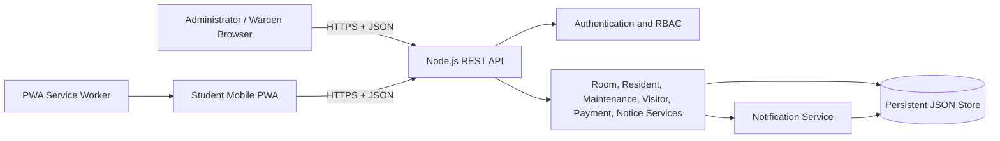

# System Architecture

## Overview

Havenly uses a three-layer architecture:

## Components

### Administrator client

`index.html`, `styles.css`, and `app.js` provide the operations dashboard. The interface reads and changes records through authenticated REST calls.

### Student client

The `/student` directory contains a mobile-first Progressive Web App. Its manifest allows installation, while the service worker caches the application shell for offline startup.

### Backend service

`server.js` provides:

- HTTP static-file delivery
- JSON body handling and response formatting
- token session management
- role and ownership authorization
- domain endpoints
- password hashing
- persistent record updates
- notification creation

### Persistence

The local demonstration database is `data/db.json`. Updates are serialized through one write queue and committed using a temporary file followed by an atomic rename. `data/seed.json` is the reproducible source dataset.

## Security model

- Passwords in the runtime database are hashed with `scrypt` and unique salts.
- Authentication tokens are generated with 256 bits of cryptographic randomness.
- Sessions expire after 12 hours.
- Students only receive complaints, payments, visitor requests, notices, and notifications in their own scope.
- Administrator-only mutations return HTTP 403 for student sessions.
- Request bodies are limited to 6 MB.
- Static paths are normalized and constrained to the application directory.

## Deployment topology

For production, the same logical architecture can be deployed as:

1. Nginx or a cloud load balancer with TLS.
2. Multiple Node.js API instances.
3. PostgreSQL for transactional data.
4. Redis for shared sessions.
5. S3-compatible storage for complaint images.
6. Firebase Cloud Messaging or Apple/Google push services.
