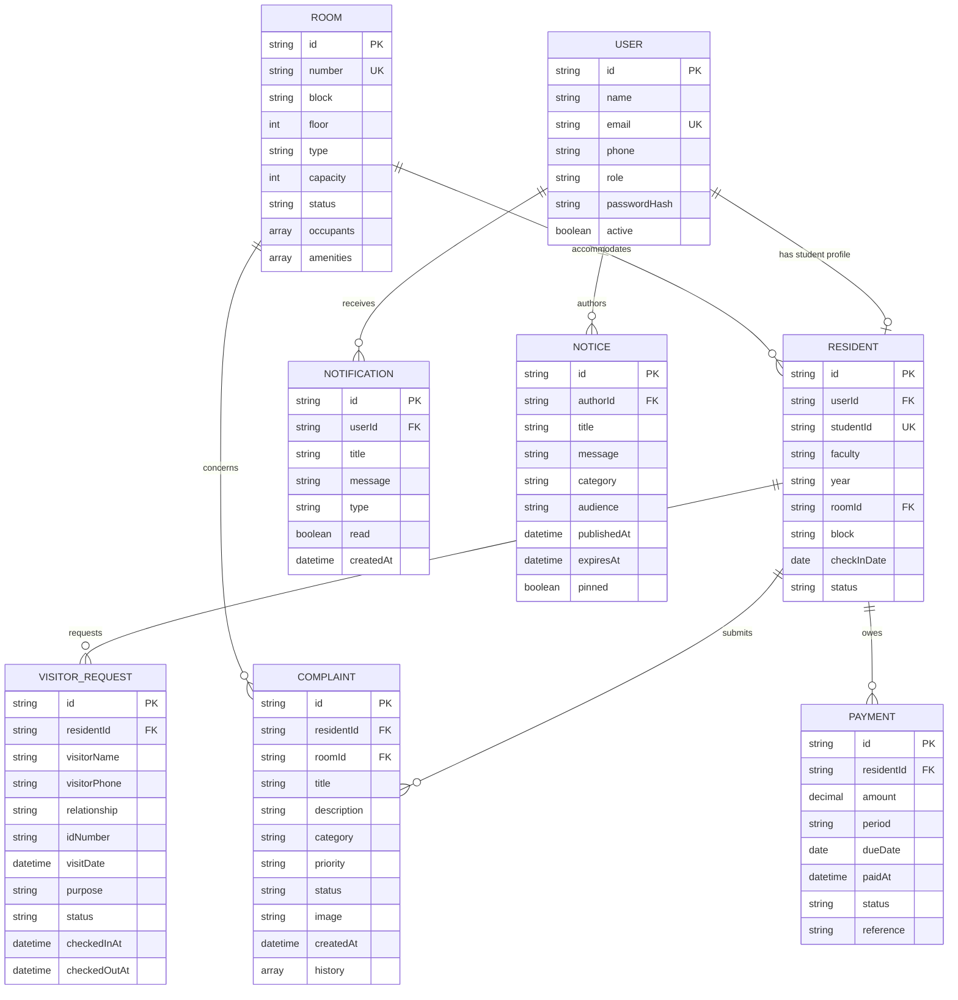

# Entity Relationship Model

Room occupancy is additionally stored as resident IDs in `ROOM.occupants` to make capacity checks and dashboard summaries inexpensive. In a relational production schema, this would normally be derived from active room-allocation records.
