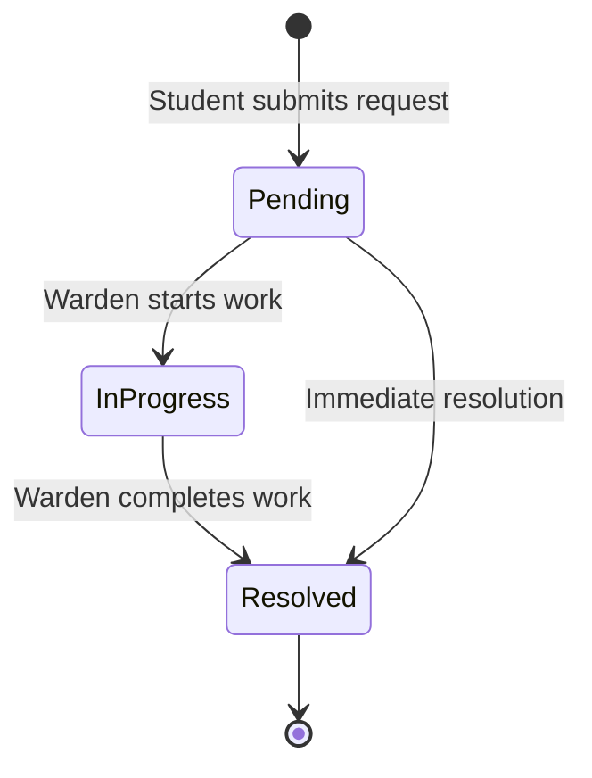
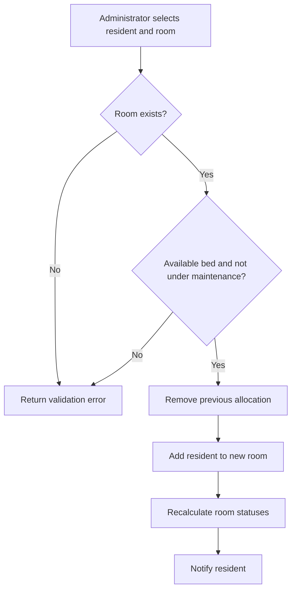

# Workflow Definitions

## Maintenance request

1. Student enters a title, category, priority, description, and optional image.
2. The platform binds the resident and assigned room automatically.
3. Wardens receive notifications.
4. Every status change is appended to the request history.
5. The student receives a status notification.

## Room allocation

## Visitor approval

1. Student submits visitor identity, relationship, expected time, and purpose.
2. Request begins in `Pending`.
3. Warden approves or declines.
4. Student receives a notification.
5. Approved visitor may later be marked `Checked in` and `Checked out`.

## Fee tracking

1. Administrator creates a fee record with amount, period, and due date.
2. Student sees the record as `Pending`.
3. Unpaid records may be changed to `Overdue`.
4. Administrator records a reference and marks it `Paid`.
5. Student receives each status update.

## Notice delivery

Notices can target `All residents`, a specific block, or an individual resident ID. The API filters notices before returning them to students and creates matching in-app notifications at publication time.
